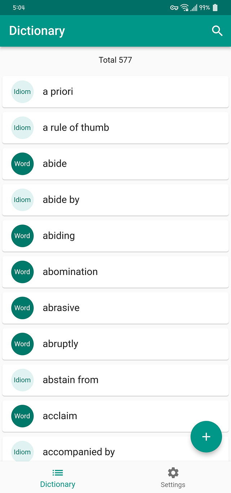
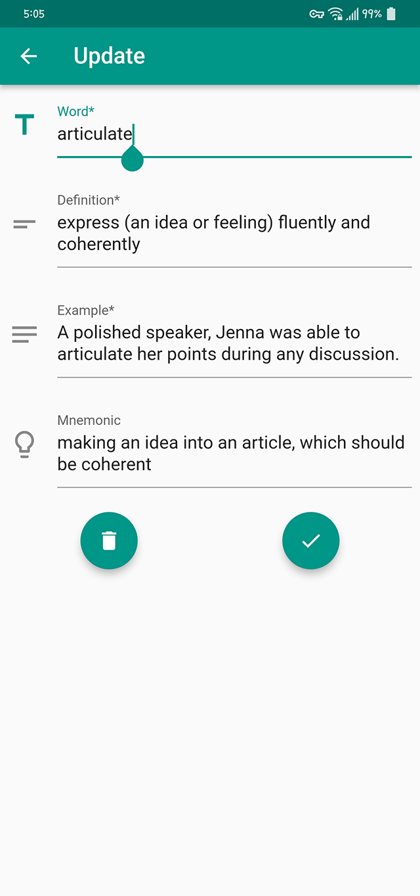
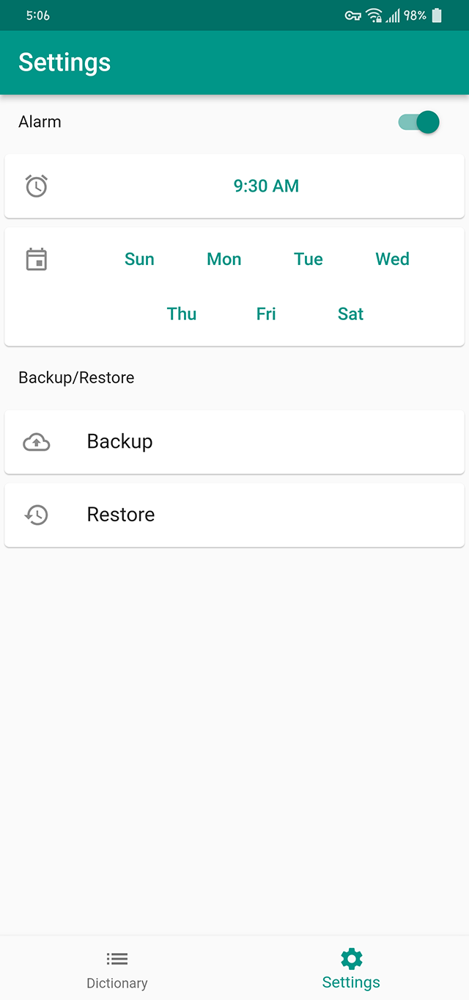
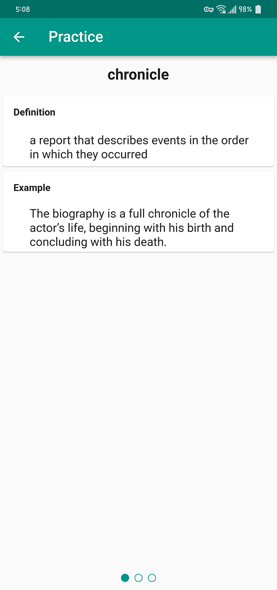
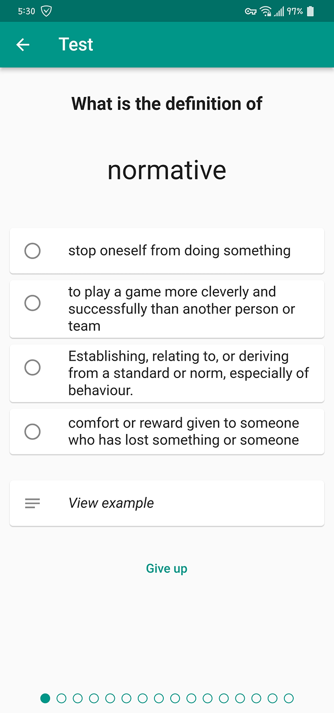
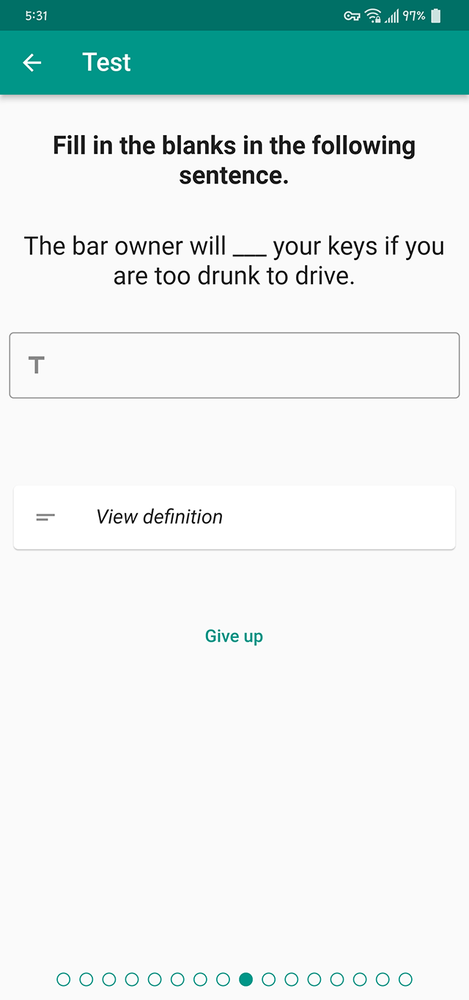

# Annoyer

Your annoying friend for learning vocabulary

## Features

- Repeated learning
  - Given some words and idioms, **Annoyer** will show you them at every half hour.
- Daily test
  - You should either sort out the definitions of words or fill in the blanks of the example sentences.
- The Less you know, the more practice
  - The level system let you practice the words that you have trouble in remembering more frequently.

## Screenshots

### Main

<p float="left">
  
  
  
</p>

### Practice

<p float="left">
  
</p>

### Test

<p float="left">
  
  
</p>


## Build

```bash
flutter pub get			# get packages
flutter build apk
```

## Install

```bash
flutter install apk
```